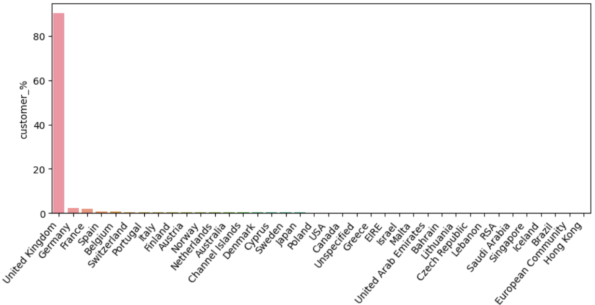
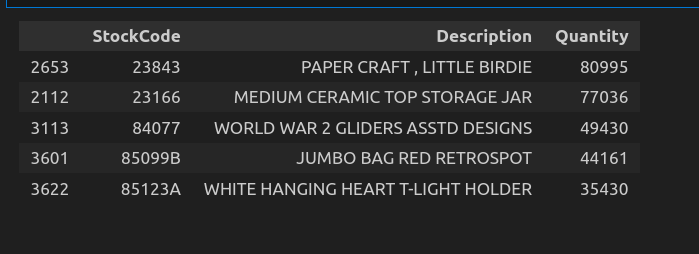

# Online Retail - Customer Segmentation

## Project Overview
This project performs customer segmentation on an online retail dataset using clustering techniques. The goal is to identify different customer groups based on purchasing behavior, which can help businesses with targeted marketing strategies.

## Dataset Description
The dataset contains transactional data from an online retail store. The key attributes include:
- **InvoiceNo**: Unique invoice number
- **StockCode**: Product code
- **Description**: Product name
- **Quantity**: Number of units sold
- **InvoiceDate**: Date and time of transaction
- **UnitPrice**: Price per unit
- **CustomerID**: Unique identifier for each customer
- **Country**: Customer's country of residence

## Data Cleaning & Exploratory Data Analysis (EDA)
### Steps Performed:
- Removed **duplicate** records (~5,268 rows dropped).
- Handled **missing values** in key columns like `CustomerID` and `Description`.
- Converted **data types** where necessary (e.g., `InvoiceDate` to datetime).
- Filtered out **canceled transactions** (invoices starting with 'C').
- Created **new features** such as total spending per customer.

### Visualizations:

- **Customer Distribution**: A bar chart showing the number of customers by country.  
  

- **Top-Selling Products**: A bar chart displaying the most frequently purchased products.  
  

## Customer Segmentation Approach
1. **Feature Engineering**
   - Created RFM features: 
     - Recency: Days since last purchase
     - Frequency: Total number of purchases
     - Monetary: Total amount spent
2. **Clustering Techniques**
   - Applied **K-Means Clustering** to segment customers into different groups.
   - Used the **Elbow Method** to determine the optimal number of clusters.
   - Performed **Silhouette Analysis** to validate cluster quality.
3. **Interpretation of Segments**
   - Identified high-value customers, occasional buyers, and low-spending customers.

## Results & Insights
- Customers were grouped into distinct segments such as:
  - **High Spenders**: Customers who make frequent purchases with high order values.
  - **Occasional Buyers**: Customers with moderate purchase frequency and spending.
  - **Low-Value Customers**: Customers who make infrequent purchases with low monetary value.
- These insights can help businesses tailor marketing campaigns and promotional strategies.
